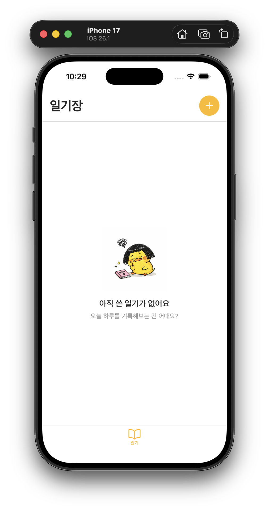
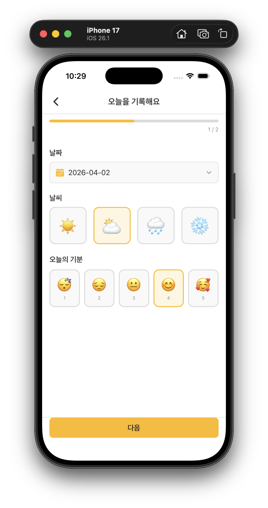
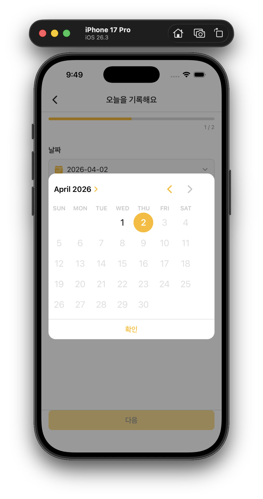
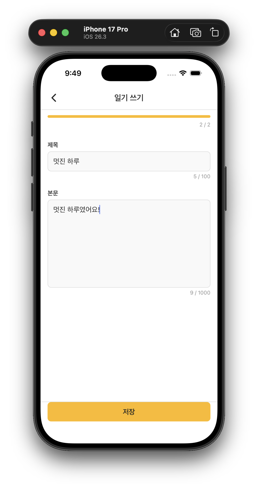
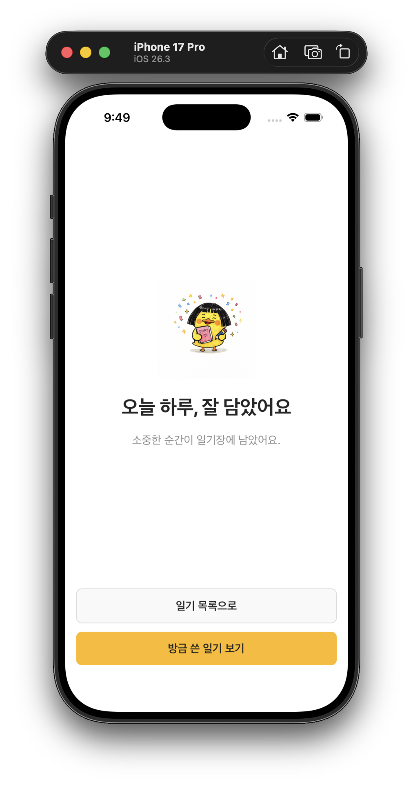
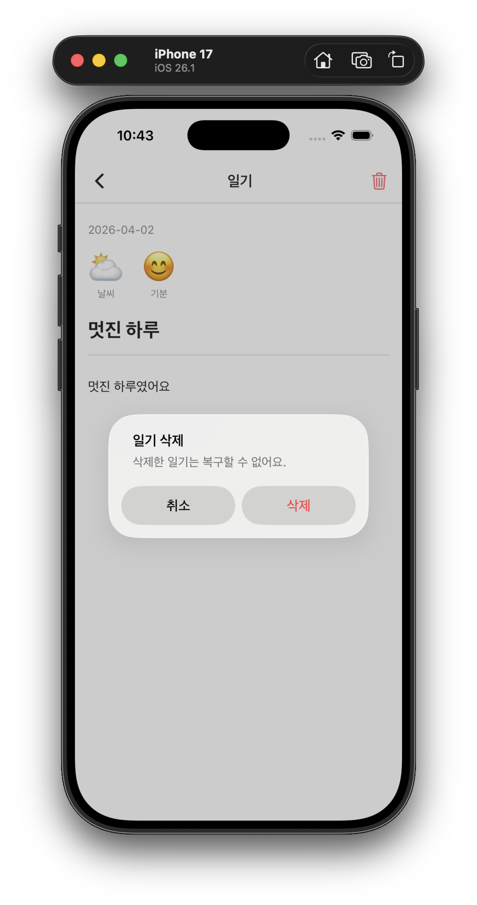
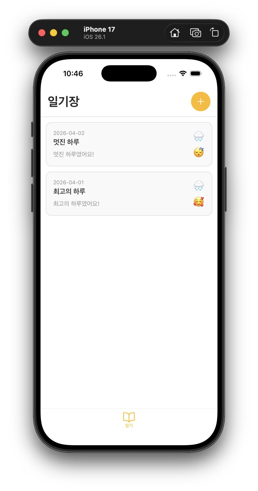

# soma0078-diary

React Native + Expo로 날씨·기분을 기록하는 일기 앱을 구현한 학습 프로젝트

## 기술 스택

- React Native 0.81.5 / React 19.1.0
- Expo SDK 54 / Expo Router 6.x
- TypeScript 5.9.2
- AsyncStorage (로컬 영구 저장)

## 실행 방법

```bash
npx expo start
```

## 구현 화면

### 일기 목록

- 전체 일기 FlatList
- 왼쪽 스와이프 → 삭제 버튼 노출 (PanResponder + Animated)
- 화면 포커스 시 자동 새로고침 (useFocusEffect)
- 빈 상태 Empty View

### 일기 작성 (2단계)

- Step 1 — 날짜(DateTimePicker), 날씨, 기분 선택
  - iOS: Modal + inline 달력
  - Android: 시스템 네이티브 다이얼로그
- Step 2 — 제목 / 본문 입력 (KeyboardAvoidingView)
- 완료 화면 → 목록 또는 상세로 이동

### 일기 상세

- 날짜 · 날씨 · 기분 · 제목 · 본문 표시
- 삭제 (Alert 네이티브 다이얼로그)
- 로딩 중 ActivityIndicator

## 핵심 학습 내용

**SafeAreaView — 노치를 피하지 않으면 콘텐츠가 가림**

- ⚠️ iOS 노치·다이나믹 아일랜드·상태바, Android 상단 상태바가 콘텐츠를 덮음
- 💡 `react-native-safe-area-context`의 `SafeAreaView` + `edges`로 방향 명시

```tsx
// ❌ react-native 내장 SafeAreaView (iOS 전용, 부정확)
import { SafeAreaView } from 'react-native';

// ✅ safe-area-context (크로스플랫폼)
import { SafeAreaView } from 'react-native-safe-area-context';

// 헤더가 있는 화면 → 상단만
<SafeAreaView edges={['top']}>...</SafeAreaView>

// 탭바 없는 풀스크린 화면 → 상하 모두
<SafeAreaView edges={['top', 'bottom']}>...</SafeAreaView>
```

`_layout.tsx`에서 `initialMetrics`를 전달하면 첫 렌더링 레이아웃 shift 방지:

```tsx
import {
  SafeAreaProvider,
  initialWindowMetrics,
} from "react-native-safe-area-context";

<SafeAreaProvider initialMetrics={initialWindowMetrics}>
  <App />
</SafeAreaProvider>;
```

---

**DateTimePicker — iOS / Android UI가 완전히 다름**

- ⚠️ iOS는 달력이 inline으로 뜨고, Android는 시스템 다이얼로그가 팝업됨
- 💡 `Platform.OS`로 분기해서 각 플랫폼에 맞는 UI 제공

```tsx
// Android: showPicker 상태로 네이티브 다이얼로그 제어
{
  Platform.OS === "android" && showPicker && (
    <DateTimePicker
      value={selectedDate}
      mode="date"
      onValueChange={(event, picked) => {
        setShowPicker(false); // 확인/취소 모두 자동으로 닫힘
        if (event.type === "set" && picked) setDate(formatDate(picked));
      }}
    />
  );
}

// iOS: Modal 안에 inline 달력 표시, 확인 버튼으로 직접 닫기
{
  Platform.OS === "ios" && (
    <Modal visible={showPicker} transparent animationType="fade">
      <DateTimePicker
        value={selectedDate}
        mode="date"
        display="inline" // iOS 전용 옵션
        accentColor={COLORS.primary} // iOS 전용 옵션
        onValueChange={handleDateChange}
      />
      <Pressable onPress={() => setShowPicker(false)}>
        <Text>확인</Text>
      </Pressable>
    </Modal>
  );
}
```

| 항목           | Android              | iOS                              |
| -------------- | -------------------- | -------------------------------- |
| 기본 표시 방식 | 시스템 다이얼로그    | spinner / inline / compact       |
| 닫힘 처리      | 자동 닫힘            | 직접 `setShowPicker(false)` 필요 |
| `display` 옵션 | `default`, `spinner` | `default`, `inline`, `compact`   |

---

**KeyboardAvoidingView — 키보드가 입력창을 가림**

- ⚠️ TextInput 포커스 시 소프트 키보드가 올라와 입력창과 버튼을 덮음
- 💡 `KeyboardAvoidingView`로 감싸고 플랫폼별 `behavior` 지정

```tsx
<KeyboardAvoidingView
  behavior={Platform.OS === "ios" ? "padding" : "height"}
  style={{ flex: 1 }}
>
  <ScrollView>
    <TextInput placeholder="제목" />
    <TextInput placeholder="본문" multiline />
  </ScrollView>
  <View style={styles.footer}>
    {" "}
    {/* 키보드 위로 올라옴 */}
    <Pressable>저장</Pressable>
  </View>
</KeyboardAvoidingView>
```

| behavior  | 동작                                      |
| --------- | ----------------------------------------- |
| `padding` | 키보드 높이만큼 하단 패딩 추가 (iOS 권장) |
| `height`  | View 전체 높이를 줄임 (Android 권장)      |

---

**FlatList 성능 최적화 — 리렌더링 방지**

- ⚠️ 리스트 항목이 많아질수록 스크롤 시 프레임 드롭 발생
- 💡 `memo` + `useCallback` + props 원시값(primitive) 전달로 불필요한 리렌더링 차단

```tsx
// 아이템 컴포넌트를 memo로 감싸고, props는 primitive로 전달
const DiaryItem = memo(function DiaryItem({
  id,
  title,
  date,
  onPress,
  onDelete,
}) {
  const handlePress = useCallback(() => onPress(id), [id, onPress]);
  const handleDelete = useCallback(() => onDelete(id), [id, onDelete]);

  return (
    <SwipeableItem onDelete={handleDelete}>
      <Pressable onPress={handlePress}>...</Pressable>
    </SwipeableItem>
  );
});

// renderItem을 useCallback으로 안정화
const renderItem = useCallback(
  ({ item }) => (
    <DiaryItem
      id={item.id}
      title={item.title}
      onPress={handleItemPress} // stable 참조
      onDelete={handleDelete} // stable 참조
    />
  ),
  [handleItemPress, handleDelete],
);
```

---

**PanResponder + Animated — 스와이프 제스처 (내장 API)**

- ⚠️ 왼쪽 스와이프로 삭제 버튼을 노출해야 함
- 💡 `PanResponder`로 터치 제스처 감지, `Animated`로 부드러운 애니메이션 구현
- 💡 `dx > dy` 조건으로 스크롤과 수평 제스처 구분 (FlatList 충돌 방지)
- 💡 네이티브 코드 불필요 — Expo Go와 native build 모두 작동

```tsx
// PanResponder 설정
const panResponder = useRef(
  PanResponder.create({
    // 수평 이동이 수직 이동보다 크면 제스처 활성화
    onMoveShouldSetPanResponder: (_, { dx, dy }) => Math.abs(dx) > Math.abs(dy),

    // 제스처 이동 중 — translateX 현재 좌표 실시간 업데이트
    onPanResponderMove: (_, { dx }) => {
      if (dx < 0) {
        const clampedX = Math.max(dx, -80); // 최대 80px까지만
        translateX.setValue(clampedX);
      }
    },

    // 손을 뗐을 때 — 스프링 애니메이션
    onPanResponderRelease: (_, { dx }) => {
      Animated.spring(translateX, {
        toValue: dx < -60 ? -80 : 0, // -60px 이상 스와이프 → 버튼 노출
        useNativeDriver: true,
      }).start();
    },
  }),
).current;
```

| 항목      | PanResponder + Animated | 고급 라이브러리 (reanimated) |
| --------- | ----------------------- | ---------------------------- |
| 설치      | 내장 (추가 패키지 없음) | 네이티브 코드 필요           |
| 학습곡선  | 낮음                    | 높음                         |
| 성능      | JS 스레드 (충분)        | UI 스레드 (매우 빠름)        |
| 사용 시기 | 일반적인 애니메이션     | 복잡한 고성능 애니메이션     |

---

**useFocusEffect — 화면으로 돌아올 때마다 데이터 갱신**

- ⚠️ 일기를 작성하고 목록으로 돌아와도 새 항목이 보이지 않음
- 💡 `useEffect`는 마운트 시 1회만 실행. `useFocusEffect`는 화면 포커스마다 실행

```tsx
import { useFocusEffect } from "expo-router";

// useEffect: 컴포넌트 마운트 시 1회
useEffect(() => {
  loadDiaries();
}, []);

// useFocusEffect: 화면이 포커스될 때마다 (다른 화면에서 돌아올 때 포함)
useFocusEffect(
  useCallback(() => {
    loadDiaries();
  }, []),
);
```

---

**AsyncStorage — 비동기 로컬 저장**

- ⚠️ 앱을 종료해도 데이터가 유지되어야 함
- 💡 웹의 `localStorage`와 달리 비동기 API, 문자열만 저장 가능

```tsx
// 웹 localStorage (동기)
localStorage.setItem("key", JSON.stringify(data));
const data = JSON.parse(localStorage.getItem("key"));

// AsyncStorage (비동기, await 필수)
await AsyncStorage.setItem("key", JSON.stringify(data));
const raw = await AsyncStorage.getItem("key");
const data = raw ? JSON.parse(raw) : [];
```

---

**Expo Router 파라미터 전달**

- ⚠️ Step1 → Step2로 날씨·기분 데이터를 넘겨야 함
- 💡 `router.push params`로 전달, `useLocalSearchParams`로 수신. 단, **모든 값이 string으로 변환됨**

```tsx
// 전달 (step1.tsx)
router.push({
  pathname: "/write/step2",
  params: { date, weather, mood: mood.toString() },
});

// 수신 (step2.tsx) — 숫자도 string으로 옴
const params = useLocalSearchParams<{
  date: string;
  weather: string;
  mood: string;
}>();
const mood = parseInt(params.mood) as MoodLevel; // 타입 변환 필요
```

## 디렉토리 구조

```
src/
├── app/
│   ├── _layout.tsx          # Root Stack (SafeAreaProvider)
│   ├── (tabs)/
│   │   ├── _layout.tsx      # 하단 탭 네비게이터
│   │   └── index.tsx        # 일기 목록 (FlatList + 스와이프 삭제)
│   ├── write/
│   │   ├── step1.tsx        # 날짜·날씨·기분 선택
│   │   ├── step2.tsx        # 제목·본문 입력
│   │   └── success.tsx      # 저장 완료
│   └── diary/
│       └── [id].tsx         # 일기 상세 + 삭제
├── components/
│   ├── ProgressBar.tsx      # 단계 진행 표시
│   └── SwipeableItem.tsx    # 스와이프 삭제 컨테이너
├── constants/
│   └── theme.ts             # 색상·이모지 상수
├── data/
│   └── storage.ts           # AsyncStorage CRUD
└── types/
    └── index.ts             # DiaryEntry, WeatherType, MoodLevel
```

## 스크린샷

<div style={display:flex;}>







</div>
